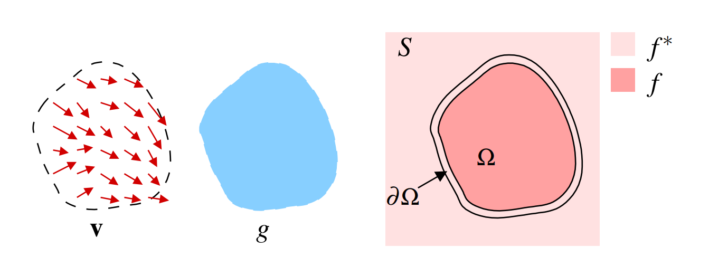

# 泊松图像编辑

* 📜 [论文链接](https://www.cs.jhu.edu/~misha/Fall07/Papers/Perez03.pdf)

## 相关资料

1. 🔗 https://www.cnblogs.com/herenzhiming/articles/5284514.html
2. 🔗 https://blog.csdn.net/u010772377/article/details/119758184
3. ✴️ https://www.cnblogs.com/3-louise-wang/p/16671316.html 
4. 🔗 https://github.com/PPPW/poisson-image-editing
5. 🔗 https://github.com/Trinkle23897/Fast-Poisson-Image-Editing
6. 🔗 https://github.com/ZqlwMatt/CV-project/tree/main/Project1-Poisson_Image_Editing

## 解决什么问题

&emsp;&emsp;解决无缝图像融合问题，即图像在融合过程当中，保持边界无缝合成。**如果源图像和目标图像有着明显不同的纹理特征，则直接合成后的图像会存在明显的边界。**

## 如何解决问题

&emsp;&emsp;论文通过**构造泊松方程求解像素最优值**的方法，来保留源域梯度信息，即根据指定的边界条件求解一个泊松方程，实现了梯度域上的连续，从而达到边界处的无缝融合。所谓无缝融合，即具体为区域内对象的纹理、照明、颜色、边界等无缝处理。

图中，$g$是源域中待融合部分， $\mathbf{v}$ 是 $g$ 的梯度向量场； $S$ 是融合后的图像； $Ω$ 是融合后目标域被覆盖的区域， $∂Ω$ 是该区域边界； $f$ 表示 $Ω$ 内的像素值（未知，待插值），用 $f^∗$ 表示 $Ω$ 外的像素值（已知，和目标域一致）。

&emsp;&emsp;**融合后的图像应该尽量保持平滑，即没有明显边界**，所以$Ω$内的梯度值尽可能小，因此需求解下面最小化问题，<br>

$$\begin{equation}\begin{aligned}
\underset{f}{min}\iint_{\Omega}|\nabla f|^2&ensp;with&ensp;f|_{\partial{\Omega}} = f^*|_{\partial{\Omega}}
\end{aligned}\nonumber\end{equation}$$

其中，$\nabla . = [\frac{\partial{.}}{\partial{x}}, \frac{\partial{.}}{\partial{y}}]$是梯度算子。显然这是一个**积分型极值**问题，需要使用**变分法**求解。令被积函数为
$$\begin{equation}\begin{aligned}
F = |\nabla{f}|^2 = f_x^2 + f_y^2
\end{aligned}\nonumber\end{equation}$$
然后代入二维的Euler-Lagrange方程，
$$\begin{equation}\begin{aligned}
\frac{\partial{F}}{\partial{f}} - \frac{d}{dx}(\frac{\partial{F}}{\partial{f_x}}) - \frac{d}{dy}(\frac{\partial{F}}{\partial{f_y}}) = 0
\end{aligned}\nonumber\end{equation}$$
可见$F$不包含$f$，因此$\frac{\partial{F}}{\partial{f}}=0$，所以我们有，
$$\begin{equation}\begin{aligned}
\frac{d}{dx}(\frac{\partial{F}}{\partial{f_x}}) + \frac{d}{dy}(\frac{\partial{F}}{\partial{f_y}}) = 0
\end{aligned}\nonumber\end{equation}$$
$$\begin{equation}\begin{aligned}
\frac{d}{dx}(f_x) + \frac{d}{dy}(f_y) = 0
\end{aligned}\nonumber\end{equation}$$
$$\begin{equation}\begin{aligned}
\frac{\partial^2{f}}{\partial{x^2}} + \frac{\partial^2{f}}{\partial{y^2}}= 0
\end{aligned}\nonumber\end{equation}$$
因此该问题的解是
$$\begin{equation}\begin{aligned}
\Delta{f} = 0 &ensp; over &ensp; \Omega &ensp; with&ensp;  f|_{\partial{\Omega}} = f^*|_{\partial{\Omega}}
\end{aligned}\nonumber\end{equation}$$
其中$\Delta . = \frac{\partial^2{.}}{\partial{x^2}} + \frac{\partial^2{.}}{\partial{y^2}}$是拉普拉斯算子。到此，依然得不到满足的效果，我们需要进一步引入约束，即通过源域中待融合区域$g$的梯度向量场$\mathbf{v}$作为求解式子的引导场，**目的就是为了使得$\Omega$中的像素值$f$的梯度不断接近$g$的梯度，可以更好的保留源域$g$的纹理，$S$的梯度域也不断变得连续、平滑、无明显的边界**。具体通过求解下述最小化问题，
$$\begin{equation}\begin{aligned}
\underset{f}{min}\iint_{\Omega}|\nabla f - \mathbf{v}|^2&ensp;with&ensp;f|_{\partial{\Omega}} = f^*|_{\partial{\Omega}}
\end{aligned}\nonumber\end{equation}$$
$\mathbf{v}=(u, v)$是$g$的梯度场，因此上式子可以写成，
$$\begin{equation}\begin{aligned}
&\underset{f}{min}\iint_{\Omega}|\nabla f - \mathbf{v}|^2 \\&= \underset{f}{min}\iint_{\Omega}|\nabla f - \nabla g|^2 \\&= \underset{f}{min}\iint_{\Omega}[(f_x-g_x)^2+(f_y-g_y)^2]\\&s.t.&ensp;f|_{\partial{\Omega}} = f^*|_{\partial{\Omega}}
\end{aligned}\nonumber\end{equation}$$
令$F=(f_x-g_x)^2+(f_y-g_y)^2$，再应用Euler-Lagrange方程，
$$\begin{equation}\begin{aligned}
\frac{d}{dx}(\frac{\partial{F}}{\partial{(f_x-g_x)^2}}) + \frac{d}{dy}(\frac{\partial{F}}{\partial{(f_y-g_y)^2}}) = 0
\end{aligned}\nonumber\end{equation}$$
$$\begin{equation}\begin{aligned}
\frac{d}{dx}[2(f_x-g_x)] + \frac{d}{dy}[2(f_y-g_y)] = 0\end{aligned}\nonumber\end{equation}$$
$$\begin{equation}\begin{aligned}
\frac{\partial^2{f}}{\partial{x^2}} + \frac{\partial^2{f}}{\partial{y^2}} = \frac{\partial^2{g}}{\partial{x^2}} + \frac{\partial^2{g}}{\partial{y^2}}
\end{aligned}\nonumber\end{equation}$$
$$\begin{equation}\begin{aligned}
\Delta f = \Delta g = \mathrm{div}\mathbf{v}
\end{aligned}\nonumber\end{equation}$$
可见该问题的解，
$$\begin{equation}\begin{aligned}
\Delta f = \mathrm{div}\mathbf{v}&ensp;over&ensp;\Omega&ensp;with&ensp;f|_{\partial{\Omega}} = f^*|_{\partial{\Omega}}
\end{aligned}\nonumber\end{equation}$$
该解是**具有狄利克雷边界条件的唯一解**。

🚀 简要提炼重要信息：<br>
1. $\Omega$ 是指融合区域，即目标图像（目标域）中哪些区域是要被融合修改的
2. $f$ 是指 $\Omega$ 区域内**融合后**的像素值；$f^*$ 是指 $\Omega$ 区域外**不作融合处理**的像素值，和目标域的像素一致
3. $g$ 是源图像（源域）内对应 $\Omega$ 区域的像素值
4. $\nabla . = [\frac{\partial{.}}{\partial{x}}, \frac{\partial{.}}{\partial{y}}]$ 是梯度算子，计算图像中每个像素点的梯度
5. $\Delta . = \frac{\partial^2{.}}{\partial{x^2}} + \frac{\partial^2{.}}{\partial{y^2}}$ 是拉普拉斯算子，计算图像每个像素点的梯度的散度（divergence，即同一个方向进行两次梯度计算）
6. $\mathbf{v}=[u,v]^\mathbf{T}=[\frac{\partial{g}}{\partial{x}}, \frac{\partial{g}}{\partial{y}}]^\mathbf{T}$ 是 $g$ 的梯度向量场
7. $\mathrm{div}\mathbf{v}$ 是 $\mathbf{v}$ 的散度，$\mathrm{div}\mathbf{v}=\nabla·\mathbf{v}=[\frac{\partial{.}}{\partial{x}}, \frac{\partial{.}}{\partial{y}}]·[u,v]^\mathbf{T} = \frac{\partial{u}}{\partial{x}} + \frac{\partial{v}}{\partial{y}}=\frac{\partial^2{g}}{\partial{x^2}} + \frac{\partial^2{g}}{\partial{y^2}}$<br>（注意：散度是标量）
7. $\Delta f = \Delta g = \mathrm{div}\mathbf{v} $

## Python实现

在偏微分方程数值求解里面，有相应的离散化公式，
$$\begin{equation}\begin{aligned}
\frac{\partial^2{f}}{\partial{x^2}} = f(x+1, y) + f(x-1, y) - 2f(x,y)
\end{aligned}\nonumber\end{equation}$$
$$\begin{equation}\begin{aligned}
\frac{\partial^2{f}}{\partial{y^2}} = f(x, y+1) + f(x, y-1) - 2f(x,y)
\end{aligned}\nonumber\end{equation}$$
于是有，
$$\begin{equation}\begin{aligned}
\Delta{f} = f(x+1, y) + f(x-1, y) + f(x, y+1) + f(x, y-1) - 4f(x,y)=0
\end{aligned}\nonumber\end{equation}$$
也相当于使用拉普拉斯卷积核对图像进行处理，
$$
\left[
\begin{matrix}
0 & 1 & 0 \\
1 & -4 & 1 \\
0 & 1 & 0 
\end{matrix} \right]
$$
*  常规融合(Importing gradients)


*  混合融合(Mixing gradients)


具体实现可查看 [https://github.com/DemonDamon/exps](https://github.com/DemonDamon/exps)，这是手撸公式的代码，并没有经过优化，仅是为了理解论文，OpenCV早已实现SeamlessClone函数，几行代码即可快速实现，
```Python
import cv2

src_img = cv2.resize(cv2.imread("src.jpg"), (300, 300))
dst_img = cv2.imread("dst.jpg")

h, w = dst_img.shape[:2]
    
src_mask = 255 * np.ones(src_img.shape, dst_img.dtype)

center = (h//2, w//2)
output1 = cv2.seamlessClone(src_img, dst_img, src_mask, center, cv2.NORMAL_CLONE)
output2 = cv2.seamlessClone(src_img, dst_img, src_mask, center, cv2.MIXED_CLONE)

plt.figure(figsize=(10, 20))
plt.subplot(1,2,1)
plt.imshow(output1[:,:,::-1])
plt.title("normal clone")
plt.subplot(1,2,2)
plt.imshow(output2[:,:,::-1])
plt.title("mixed clone")
plt.show()
```

## 展望

&emsp;&emsp;目前有相关研究或专利，针对GAN结合泊松图像融合的方式进行图像数据增强，尤其是医学影像的数据增强对于敏感性和特异性指标有着一定实践意义。
 


